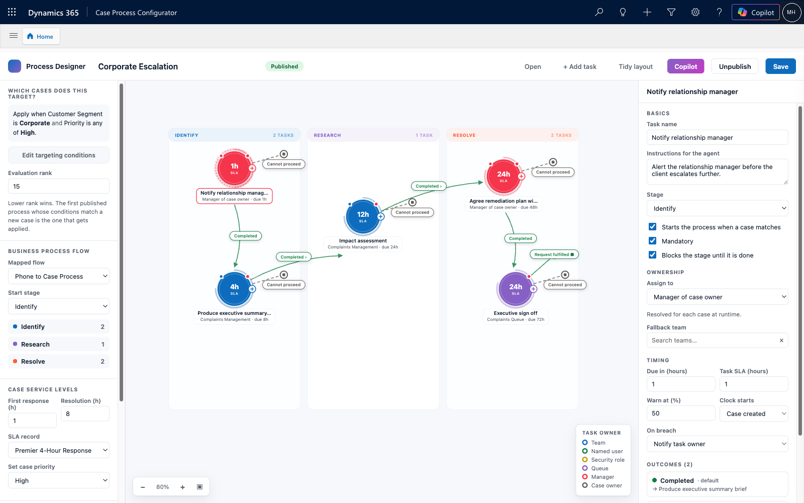
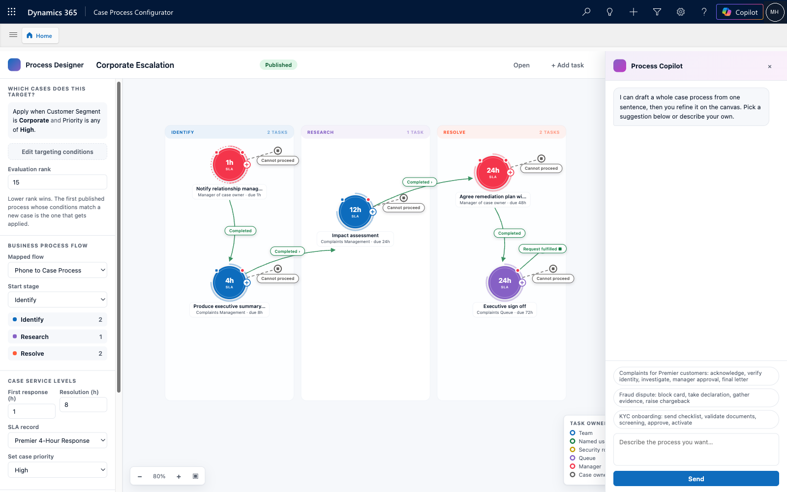
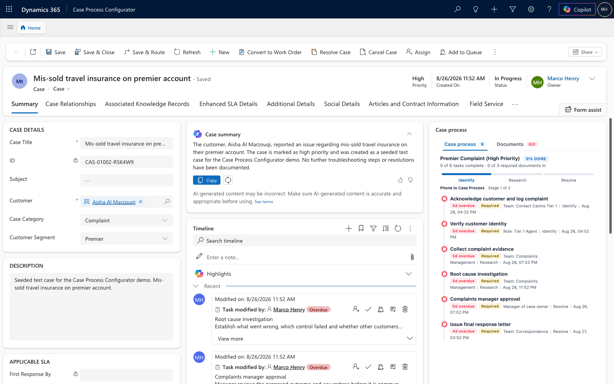
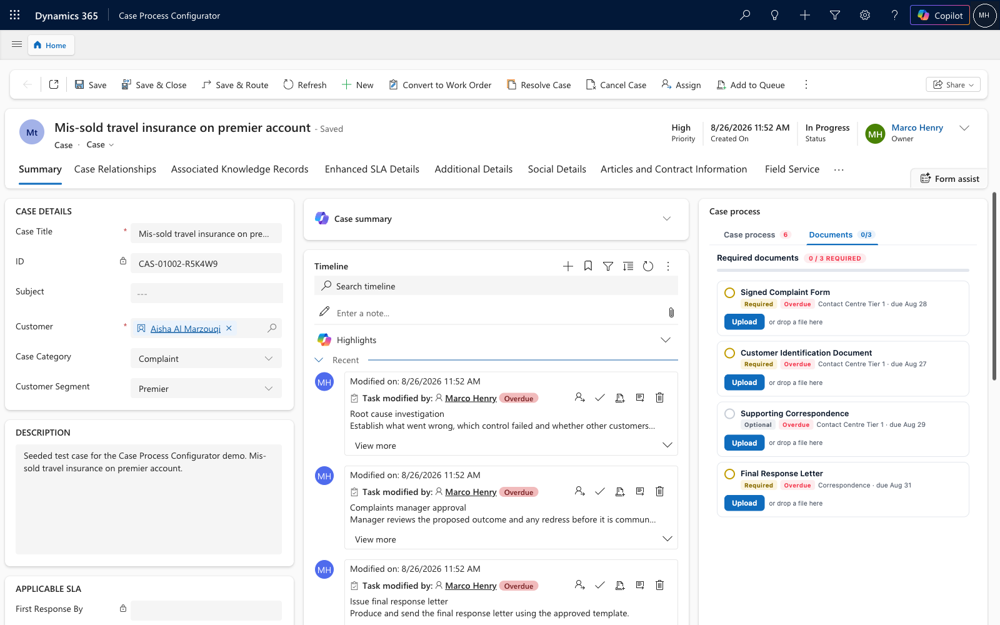
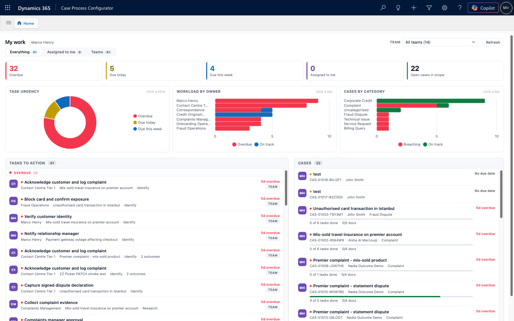

# Case Process Configurator

**A declarative, business-user-configurable case handling accelerator for Microsoft Dynamics 365 Customer Service and Dataverse.**

> [!WARNING]
> **This is a demonstration accelerator. It is not built, reviewed or tested for production use, and is provided "as is" with no warranty and no support. Use entirely at your own risk.** Deploy only to a disposable trial, developer or sandbox environment — never to production, and never to an environment holding real personal, regulated or business-critical data. Please read the full [DISCLAIMER](DISCLAIMER.md) before installing.

---

## The problem

In most case management implementations, "how we handle this type of case" is buried in code —
plug-ins, workflows, hard-coded task lists, branching logic in JavaScript. When the business wants
to change the order of two steps, add a required document, reassign a step to a different team, or
tighten an SLA, they raise a change request and wait weeks for a developer.

The process knowledge lives with the business. The ability to change it lives with IT.

## What this accelerator does

It moves the entire case handling process into **configuration data that a business user owns**.

A **Case Process Template** answers two questions:

1. **Which cases does this apply to?** — a set of match rules (category, priority, customer segment,
   channel, value thresholds, and so on) evaluated against the case.
2. **What happens to those cases?** — applied automatically the moment the case is created:
   - the **SLA** (first response and resolution targets),
   - the **Business Process Flow** to run, and which stage to start in,
   - an **outcome-driven task graph** — the tasks to create, in what order, owned by which team or user, each with its own SLA,
   - the **document packages** that must be collected, with mandatory flags and due dates.

The distinguishing idea is the **outcome-driven task graph**. A task is not just an item on a
checklist — it publishes a set of possible outcomes ("Approved", "Rejected", "More information
needed", "Escalate to credit committee"). When an agent records an outcome, the engine decides
what happens next: which task to create, who owns it, whether to advance the business process flow
stage, whether to request additional documents. The same starting case can follow completely
different paths depending on what actually happens — and every one of those paths is configuration,
not code.

Business users build these processes in a **drag-and-drop visual designer**, or simply **describe
the process to Copilot in natural language** and have it generated for them.

---

## Screenshots

### Visual process designer

Business users lay out the task graph directly. Tasks are circular nodes carrying their SLA in the
centre; connectors are labelled with the outcome that triggers them; swimlanes map tasks onto
business process flow stages and stretch to fit their contents.



### Authoring a process with Copilot

Describe the process in plain language and have the template, task graph, owners, SLAs and document
requirements generated — then refine them in the designer.



### Runtime — case process progress

On the case form, agents see the live task graph: current stage, what is open, what is overdue, and
the outcomes available on each task. Recording an outcome drives the next step.



### Runtime — required documents

The second tab of the same panel tracks the document package: what is mandatory, what has been
received, what is outstanding and when it is due.



### My work dashboard

A combined personal and team workload view with interactive, cross-filtering charts. Click a
doughnut slice, an owner bar or a category bar to filter the task and case lists beneath.



---

## Main capabilities

### Configuration — owned by the business

| Capability | What it gives you |
|---|---|
| **Case process templates** | A single record defining targeting plus everything applied at runtime. Versioned, activatable, and orderable by priority when several could match. |
| **Match rule builder** | Compose targeting conditions over case fields — category, priority, origin, customer segment, value thresholds — with AND/OR grouping. Test rules against real cases before activating. |
| **Visual task designer** | Drag-and-drop authoring of the outcome-driven task graph. Circular task nodes with inline SLA, labelled outcome connectors, and elastic swimlanes per business process flow stage. |
| **Copilot process authoring** | Describe a process in natural language and have the template, tasks, outcomes, owners, SLAs and document requirements generated for you. |
| **Task outcomes** | Each task publishes its own outcome set. Outcomes drive branching, so one template can express many real-world paths. |
| **Per-task assignment** | Route each task to a specific team, a named user, the case owner, or the case owner's manager. |
| **Per-task SLA** | Each task carries its own due target, independent of the case-level SLA. |
| **Document packages** | Reusable bundles of required documents with mandatory flags, sequence, due offsets and template links. |
| **Business process flow binding** | Bind a template to a BPF and a starting stage; stages advance automatically as outcomes are recorded. |

### Runtime — automatic on case creation

| Capability | What it gives you |
|---|---|
| **Automatic template matching** | On create, the engine evaluates active templates in priority order and applies the first match. No manual selection. |
| **SLA stamping** | First response and resolution targets written to the case from the template. |
| **BPF application** | The bound business process flow is instantiated and set to the configured starting stage. |
| **Outcome-driven task creation** | The initial tasks are created with owners and SLAs. Recording an outcome creates the next task in the graph. |
| **Document requirement generation** | Required document records created from the template's document packages. |
| **Case rollups** | Open/total task counts, received/total document counts and progress maintained on the case for views and dashboards. |

### Agent experience

| Capability | What it gives you |
|---|---|
| **Tabbed case panel** | One space-efficient panel on the case form with tabs for case process and required documents, each showing a live count badge, turning red on overdue or outstanding mandatory items. |
| **Outcome picker** | Record a task outcome from the case, driving the process forward. |
| **Modern SLA timer** | The supported SLA KPI timer control on the case form, showing the live first-response and resolution countdowns stamped by the engine. |
| **My work dashboard** | Personal and team workload in one view, with a team picker and a mine/team/everything scope switch. |
| **Interactive charts** | Task urgency doughnut, workload by owner, and cases by category — all clickable and cross-filtering, with removable filter chips. |
| **Click-through** | Open any task or case directly from the dashboard. |

### AI agents as process participants

A task in the graph can be owned by an **AI agent** instead of a person or a team. The agent is a
first-class participant in the same outcome-driven process — it receives the same context, records
one of the same published outcomes, and advances the same graph.

| Capability | What it gives you |
|---|---|
| **Agent-assigned tasks** | Assign any task to an AI agent, configured declaratively alongside human tasks — no separate orchestration layer. |
| **Scoped context** | Choose exactly what the agent may see: case fields, case narrative, customer profile, other cases for the customer, notes, emails, prior task outcomes, required documents and SLA status. |
| **Outcome modes** | The agent either selects one of the task's published outcomes, or proposes one for a human to confirm. |
| **Confidence threshold and autonomy** | Set the confidence required before an agent may complete a task unattended; below it, the task is handed to a person. |
| **Output targets** | The agent's work is written back as a note on the case, or as the task's resolution. |
| **Human authority preserved** | Approval, waiver and customer-facing steps stay human by design. The agent prepares; a person decides. |

### Email to case

| Capability | What it gives you |
|---|---|
| **Inbound email triage** | An inbound customer email is read, classified and turned into a case with the right category, priority and customer link. |
| **Automatic process application** | The created case flows straight into the normal matching engine, so a template applies with no manual step. |
| **Queue and mailbox wiring** | Build scripts configure the queue, mailbox and email-derived columns end to end. |

### Process authoring from a written procedure

| Capability | What it gives you |
|---|---|
| **Upload an SOP** | Give the designer Copilot a real standard operating procedure as a Word document and it designs the process from it. |
| **Grounded in your environment** | The design is generated against what actually exists — your business process flows, teams, SLAs, document packages and AI agents — not invented names. |
| **Stated assumptions** | Every inference, gap and mapping decision is surfaced explicitly rather than hidden, so a reviewer can see what the model had to assume. |
| **Preview before commit** | The authored process is validated against the environment and previewed before anything is written. |

### Technical

- **10 custom Dataverse tables** — templates, match rules, process tasks, task outcomes, document packages, document items, applied processes, case required documents, plus two generated business process flow entities.
- **Custom APIs** — `GetCaseView`, `GetProcessGraph`, `SaveProcessGraph`, `GetProcessCatalog`, `TestMatchRules`, `AuthorProcess`, `DesignProcess`, `BuildCaseContext`, `PrepareAgentTask`, `GetAgentCatalog`, `CompleteAgentTask`.
- **Sandboxed C# plug-in assembly** — the process engine, running in the supported sandbox isolation mode.
- **Model-driven app** with configuration, runtime and setup areas.
- **Web resources** — visual designer, case process widget, required documents widget, tabbed case panel, outcome picker, workload dashboard.
- **Chart.js bundled as a web resource**, not loaded from a CDN, so the dashboard works in locked-down tenants with restricted script origins.
- **No secrets in the solution** — the Azure AI Foundry connection is held in Dataverse environment variables whose *values* are deliberately excluded from the exported solution, so no credential can ever travel in a solution zip.
- **Idempotent Python build scripts** — every step can be re-run safely, so the whole solution can be rebuilt from source against a fresh environment.

---

## Installation

Two options — import the solution, or build it from source.

**See [INSTALL.md](INSTALL.md) for full step-by-step instructions**, including prerequisites,
post-import configuration, sample data, verification and uninstall.

Quick summary:

```bash
# Option A — import the packaged solution (fastest)
#   Power Platform admin centre -> Solutions -> Import
#   -> solution/CaseProcessConfigurator_1_2_0_0_managed.zip
#   Import the Modern SLA Timer PCF first - see INSTALL.md.
#   Then run the post-import steps in INSTALL.md.

# Option B — build from source against your own environment
az login
export DATAVERSE_URL="https://yourorg.crm.dynamics.com"
cd src
python3 step1_solution.py && python3 step2_tables.py   # ... see INSTALL.md
```

> [!IMPORTANT]
> Installing modifies your environment. It creates tables, registers a plug-in assembly and custom
> APIs, adds a model-driven app and edits the site map. Use a disposable environment.
>
> It does **not** modify any Microsoft form. Since 1.2.0 the solution ships two forms of its own,
> **Case (CPC)** and **Task (CPC)**, and leaves the stock Case and Task forms untouched — verified
> by fingerprinting all 26 Case and Task forms in a vanilla Customer Service environment before and
> after import: 26 of 26 identical, 0 changed, 2 added. Its only non-Customer-Service dependency is
> the third-party [Modern SLA Timer PCF](https://github.com/moliveirapinto/modern-sla-timer-pcf),
> which is deliberately not bundled and must be imported first.

---

## Repository layout

```
solution/                 Packaged solution (.zip) — managed and unmanaged
src/                      Build scripts, plug-in source and web resources
  dv.py                   Dataverse Web API helper (reads DATAVERSE_URL)
  step*.py                Idempotent build steps, in order
  plugin/                 C# plug-in and custom API source
  webresources/           Designer, runtime widgets and dashboard
docs/images/              Screenshots
INSTALL.md                Installation, verification and uninstall
DISCLAIMER.md             Full disclaimer — please read before installing
LICENSE                   MIT
```

---

## A sibling accelerator for sales

The same idea applied to the opportunity table is available as a separate, fully isolated
accelerator: [**Sales Process Configurator**](https://github.com/erturkm/sales-process-configurator).
Where this one targets cases by subject, that one targets deals by the product lines on the
opportunity, and applies qualification and close clocks, a sales business process flow, an
outcome-driven task graph and required deal documents.

The two solutions share no components and can be installed independently or side by side.

---

## Licence and disclaimer

Released under the [MIT Licence](LICENSE).

This is an independent personal open-source project. It is **not** a Microsoft product and is not
affiliated with, endorsed by or supported by Microsoft Corporation. Microsoft, Dynamics 365,
Dataverse, Power Platform and Copilot are trademarks of the Microsoft group of companies.

All sample data, template names and scenario content are fictitious and illustrative only. The
banking-oriented examples do not constitute financial, legal, regulatory or compliance advice.

**Please read the full [DISCLAIMER](DISCLAIMER.md) before you install or use this software.**
